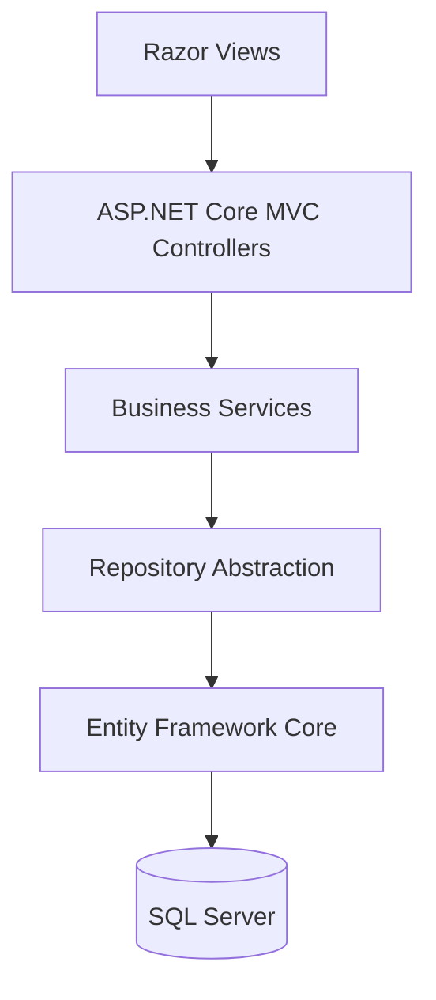

# Market Retribution Management System

A web-based information system for managing **market service retribution** operations, covering media stock, serial number distribution, receipts, deposits, arrears, reporting, and administrative monitoring.

This project was built as a portfolio project using **ASP.NET Core MVC (.NET 8)**, **Entity Framework Core**, and **SQL Server**, with business rules designed around a real-world retribution workflow.

[](https://dotnet.microsoft.com/)
[](https://learn.microsoft.com/aspnet/core/)
[](https://learn.microsoft.com/ef/core/)
[](https://www.microsoft.com/sql-server)

## Live Demo

**Staging:** http://retribusipasar-staging.runasp.net/

> The staging environment is intended for demonstration and testing only. It is currently hosted on a free hosting plan, so availability may vary.

## Overview

The application digitizes a workflow that was previously handled through manual records and physical retribution media such as **STRD** and **Karcis**.

The core process is:

```text
Media Stock
    ↓
Distribution to Market
    ↓
Retribution Collection / Receipt
    ↓
Deposit
    ↓
Monitoring & Reporting
```

Each physical media item is tracked using a **6-digit serial number range**, allowing the system to validate stock allocation, distribution, usage, and duplicate serial usage.

## Main Features

- Dashboard monitoring with charts and summary metrics
- Receipt / collection transaction management
- Deposit transaction management
- STRD and ticket stock management
- Media distribution to each market
- Serial number tracking
- Arrears monitoring
- Market master data
- Retribution type master data
- Tariff and tariff history management
- Kiosk / stall / unit management
- Collector / officer management
- Reporting and recapitulation
- User and role management
- Audit trail
- Accounting period closing
- Cookie-based authentication
- Dark / light mode
- Responsive modern UI
- Select2-enhanced dropdowns
- Modal-based create and edit forms
- Numeric input formatting

## Key Business Rules

The project contains business validation beyond standard CRUD operations.

### Media Stock & Distribution

- Serial numbers use a **6-digit range**.
- Stock ranges for the same media type cannot overlap.
- A distribution must be fully covered by available stock.
- Distribution ranges cannot overlap with another active distribution.
- Serial numbers already used in an active receipt cannot be redistributed.

### Receipt Transaction

When a kiosk / stall / unit is selected, the application automatically determines:

- Market
- Retribution type
- Collector
- Media type
- Active tariff

The server remains the source of truth, so these values are validated again on the backend instead of relying only on JavaScript.

Additional validation includes:

- Media serials must have been distributed to the selected market.
- Used serial numbers cannot be used twice.
- Transactions cannot be created in a closed accounting period.
- Expected amounts are calculated from the active tariff.
- Per-transaction retribution can calculate amounts based on the number of serials used.
- Deleted receipt transactions are preserved as historical records using a soft-delete status.

### Deposit Transaction

- One receipt can only be assigned to one deposit.
- Deposit values are calculated from the selected receipt transactions.
- Receipt-to-deposit relationships are stored through a junction table.

## Architecture



The repository abstraction keeps data access separated from controllers and business logic.

```text
Razor View
    ↓
Controller
    ↓
Business Service
    ↓
IRepository<T>
    ↓
EfRepository<T>
    ↓
Entity Framework Core
    ↓
SQL Server
```

Core domain rules are primarily handled in `RetributionBusinessService`, keeping important validation outside the browser.

## Tech Stack

| Area | Technology |
|---|---|
| Backend | C#, ASP.NET Core MVC (.NET 8) |
| Frontend | Razor Views, HTML, CSS, JavaScript |
| ORM | Entity Framework Core |
| Database | SQL Server |
| Authentication | ASP.NET Core Cookie Authentication |
| UI Components | Select2 |
| Charts | Chart.js |
| Password Hashing | ASP.NET Core `PasswordHasher<T>` |
| Hosting | ASP.NET Core / IIS compatible hosting |

## Project Structure

```text
RetribusiPasar/
│
├── RetribusiPasar.sln
├── README.md
├── PUBLISH_STAGING.md
│
└── RetribusiPasar.Web/
    ├── Controllers/
    ├── Infrastructure/
    │   ├── AppDbContext.cs
    │   ├── DatabaseInitializer.cs
    │   └── Repositories/
    ├── Models/
    │   ├── Entities/
    │   └── ViewModels/
    ├── Services/
    ├── Views/
    ├── wwwroot/
    │   ├── css/
    │   ├── js/
    │   └── lib/
    ├── Database/
    │   └── 01_schema.sql
    ├── Program.cs
    └── appsettings.json
```

## Database Design

Main tables include:

```text
MstMarket
MstRetributionType
MstTariff
MstCollector
MstRetributionUnit

TrxStockBatch
TrxMediaDistribution
TrxReceipt
TrxDeposit
TrxDepositReceipt

AppUser
AccountingPeriod
AuditLog
```

`TrxDepositReceipt` acts as the relationship table between deposits and receipt transactions.

## Getting Started

### Prerequisites

- .NET 8 SDK
- Visual Studio 2022 or later / VS Code
- SQL Server or SQL Server LocalDB

### 1. Clone the repository

```bash
git clone https://github.com/YOUR_USERNAME/market-retribution-management-system.git
cd market-retribution-management-system
```

### 2. Configure the database connection

Do **not** store production credentials inside `appsettings.json`.

For local development, use .NET User Secrets:

```bash
cd RetribusiPasar.Web

dotnet user-secrets init

dotnet user-secrets set "ConnectionStrings:DefaultConnection" "Server=(localdb)\\MSSQLLocalDB;Database=RetribusiPasarDb;Trusted_Connection=True;TrustServerCertificate=True;MultipleActiveResultSets=True"
```

Optional seed credentials can also be stored in User Secrets:

```bash
dotnet user-secrets set "Seed:AdminPassword" "YOUR_LOCAL_ADMIN_PASSWORD"
dotnet user-secrets set "Seed:OperatorPassword" "YOUR_LOCAL_OPERATOR_PASSWORD"
```

### 3. Restore and run

```bash
dotnet restore
dotnet run
```

Then open the URL shown by ASP.NET Core in the terminal.

## Database Initialization

The application supports automatic database initialization for staging and development environments.

```json
"Database": {
  "AutoCreate": true,
  "SeedDemoData": true
}
```

When enabled, the application can create the required schema and seed demo data when the database is empty.

A manual SQL schema is also available at:

```text
RetribusiPasar.Web/Database/01_schema.sql
```

## Production / Staging Configuration

Secrets should be supplied through environment variables or a secure secret store.

Example environment variable names:

```text
ConnectionStrings__DefaultConnection
Database__AutoCreate
Database__SeedDemoData
Seed__AdminPassword
Seed__OperatorPassword
```

Never commit real database credentials, passwords, or production secrets to the repository.

## UI / UX Highlights

The application uses a modern dashboard-oriented interface with:

- Responsive sidebar navigation
- Persistent sidebar scroll position
- Light / dark theme
- Interactive charts
- Modal CRUD forms
- Global loading overlay
- Select2 dropdowns
- Formatted numeric input
- Icon-based table actions
- Automatic receipt form context based on the selected unit

## Audit & Security

Current security-related features include:

- Cookie authentication
- Role claims
- Password hashing using `PasswordHasher<T>`
- Anti-forgery validation on POST forms
- Audit log for key CRUD operations
- Closed-period transaction validation
- Server-side validation for critical business rules

For a production deployment, additional hardening such as login lockout, rate limiting, password reset, structured logging, database backup, and stronger authorization policies should be considered.

## Future Improvements

Potential next improvements include:

- Automated unit and integration testing
- Excel / PDF report export
- Attachment support for deposit evidence
- More granular role-based authorization
- Pagination and advanced filtering
- Database migration strategy using EF Core Migrations
- Concurrency handling for multi-user transactions
- Structured logging and monitoring
- Automated CI/CD deployment

## Purpose

This repository is intended as a **portfolio and learning project** demonstrating the implementation of:

- ASP.NET Core MVC architecture
- Real-world business rule validation
- Repository pattern
- Entity Framework Core data access
- SQL Server relational modelling
- Authentication and authorization
- Transactional data processing
- Responsive dashboard UI
- Deployment-ready configuration management

> Demo data should be used for testing. Do not store real personal, financial, or production data in the public staging environment.
